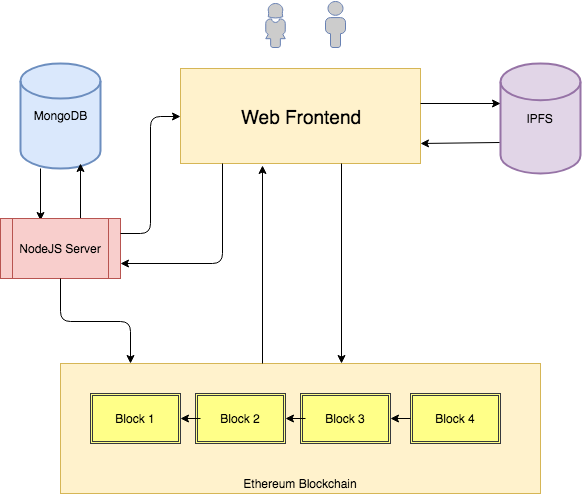
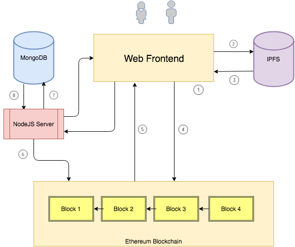

# 1. Introduction

## 1.1 Welcome

### Decentralized Auction Systems on Ether and IPFS

This is a decentralized auction system. Sellers can sell their products at auction here, and buyers can bid on them.

All the business logic and data will be placed on the Ethernet blockchain, which makes it a completely decentralized application. Storing images and large texts on Ether is very expensive (and sometimes impossible due to the limitations of EVM). To solve this problem, we will store images and large texts in IPFS (Inter Planetary File System).

## 1.2 Project Details

All the functions that will be implemented in this project:

- List items. The platform should be able to allow sellers to display their products. For ease of query, we keep data in both on-chain and off-chain databases.

- Putting files into IFPS: Uploading images and product descriptions to IPFS.

- View Products

- Auction: Vickery Auction. Unlike centralized applications, everything on Ether is public and our implementation will be a little different. Our implementation will be similar to the way ENS works.

- Escrow Contract：Once the bids are closed and there is a winner for the item, we create an escrow contract between the buyer, the seller and an arbitrary third party.

- 2/3 signatures: We will add fraud protection by implementing 2/3 multiple signatures, meaning that two out of three participants agree before the funds are released to the seller, or returned to the buyer.

# 2. Schedule

## 2.1 Application Architecture

Before we start implementing the code, let's take a look at the architecture of the Dapp we will build.

- Web Frontend: The web frontend is a combination of HTML, CSS and JavaScript (with heavy use of web3js). Users will interact with the blockchain, IPFS and NodeJS servers through this front-end application.

- Blockchain: This is the core of the application, where all the code and transactions are on the chain. All items in the store, user bids and escrow contracts are on the chain.

- MongoDB：Even though products are stored on the blockchain, it is time consuming to display products by querying the blockchain and applying various filters (e.g., only show products of a certain category, show products that are about to expire, etc.). We will use MongoDB database to store the product information and display the products by querying MongoDB.

- NodeJS Server：This is the back-end server through which the front-end communicates with the blockchain. We will expose some simple APIs for the front-end to query and retrieve products from the database.

- IPFS: When a user shelves an item in the store, the front-end uploads the product file and description to IPFS and stores the hash of the uploaded file on the chain.

Architecture Diagram：

## 2.2 Application Process

To understand the components that we talked about in the previous section, let's take a look at how the process works for a user to list an item.

- When the user enters the product details (name, starting price, image, description information, etc.) and clicks save, the web front-end will include an HTML form.(1)

- The web front-end uploads product images and descriptions to IPFS and returns links to these uploaded contents.(2) and (3)

- The web frontend then calls a contract to store the product information and IPFS link to the chain. When the contract successfully adds the product to the blockchain, an event is triggered. The event contains all the product information.(4) and (5)

- The NodeJS server is used to listen for these events, and when the event is triggered by a contract, the server reads the event content and inserts the product information into MongoDB.(6), (7) and (8)

Flow Chart：

## 2.3 Implementation steps

1. We will first implement the contract using the solidity and truffle frameworks, deploy the contract to ganache and interact with the contract through the truffle console.

2. We will then use IPFS, install it and interact with it via the command line.

3. Once the back-end implementation is complete, we will build the front-end to interact with the contracts and IPFS. We will also implement the front-end to bid and display auctions.

4. We will install MongoDB and design the data structure to store the product.

5. Once the database is up and running, we'll implement NodeJS server-side code to listen for contract events and log requests to the console. We will then implement the code to insert products into the database.

6. We will be updating the front end from the database rather than querying the product from the blockchain.

7. We will implement the escrow contract and the corresponding front-end to release or withdraw funds to the buyer/seller when two out of three people agree to release the funds.

# 3. About Vickery Auction

## 3.1 How the auction works

The following is an example of auction used in ebay.

Let's say an item is priced at $10. As long as it is above $10, you can bid whatever you want:

1. Alice is bidding $10.50. Then, she is a strong contender for the auction.

2. Mary now sees a bid of $10.50, then she bids $15. Despite her bid of $15, the highest price shown on eBay is $10.75. Although Alice loses the bid, she can bid again.

3. John now sees a bid of $10.75, then he bids $12, but eBay will bid on behalf of Mary (since Mary has already bid $15) and raise the price to $12.25 ($0.25 higher than John's bid). So, John loses the bid.

4. Now Alice is going to bid $17. Because Alice's bid is higher than Mary's, eBay adjusts the bid to $15.25 ($0.25 higher than Mary's bid). Mary loses the bid (she can make a higher bid again if she wants)

5. There are no more bids, so Alice wins the auction. Even though Alice bid $17, she only had to pay $15.25.

## 3.2 Sealed-bid Auction

The type of auction we just learned is called Vickery Auction.

Anyone can monitor transactions to see if anyone else is bidding on an item. Going back to the example in the previous section, when Mary bids $15, no one but Mary and eBay knows exactly how much she bid. But on ethereum, everyone will know how much she bid, and it will effectively become an open auction. To solve this problem, we will use a slightly different format than the Vickery auction, where the bidder submits an encrypted bid so that no one knows what the bid is. At the end of the auction, all participants present their bids, and everyone can see how much everyone has bid. The contract verifies that the sealed bids match the open bids and then determines the final winner. The winner pays the amount of the second highest bid. This is very similar to the ENS auction.

Another thing that is very different is that in eBay, when you place a bid, you submit the amount to win the bid, but the actual amount paid is not the submitted bid. In our case it is different, when a user bids they must also send ETH.

Still with the example from the previous section, let's look at how it actually works on the blockchain.

>Alice bid $10.50 for the item

In our system, if Alice wants to bid $10.50, she will hide the bid `keccak256($10.50, "secretstring")`, generating a hash 3fc3ac1afb93b6c29dc1a7d03cbff392ab89638475ed0fe7a3923facfe1dab67. She then sends this string out and sends $15 worth of ETH. Anyone who saw the transaction knew she sent $15, but no one knew she was only bidding $10.50.

>Mary find that Alice sent $15 by looking at the blockchain records. Mary wants to bid $15.

In this case, Mary doesn't know that Alice offered $10.50. She knows that Alice sent $15. If Mary wants to bid $15, she can hash keccak256($15, "marysecretstring") and send the hashed string, along with $15 or more ETH.

Similarly, everyone can place a bid on an item they want to buy.

Note that a user may send a smaller amount than the actual bid to confuse others. For example: Alice bids `keccak256($30, "secretstring")`, but only actually transfers $20 to the contract. In this case, when she reveals the bid, the contract will return that money because it was an invalid bid.

>John By checking the blockchain records, he found that the highest transfer was $15, but he didn't know the current highest bid.

In this case, John offered only $12, because that was the amount he was willing to pay.

## 3.3 Reveal Bid

Once the auction ends, all bidders must reveal their bids. In order to reveal their offers, the bidders must send the contract the amount of their bid and the secret string (which they have hashed their bid with). The contract constructs a hashed offer by combining the offer amount with the secret string, and then matches it with the hashed string previously sent by the bidder. If the match is successful, the bid is valid. Otherwise, the bid is invalid and the contract returns the corresponding funds.

Let's go back to the previous example and see how reveal bid works.

### Alice reveals her bid

Alice reveals her bid by sending $10.50 and a "secretstring" to the contract. The contract uses the same algorithm to generate the hash. In this example, the generated hash will be the same as the 3fc3ac1afb93b6c29dc1a7d03cbff392ab89638475ed0fe7a3923facfe1dab67 sent by Alice. Since this is a valid bid and Alice sends $15, the contract records it as a valid bid and returns $15 - 10.5 = 4.5 to Alice.

### Mary reveals her bid

Similarly, Mary has to reveal her bid. Since her bid is $15, she is the highest bidder, and Alice becomes the second highest bidder. Since Alice did not win the bid, she gets all her money back.

### John reveals his bid

John bids only $12. When the bid is revealed, John receives his money back immediately because he lost the bid.

In this case, Mary wins the bid and pays $12 (the second highest offer).

